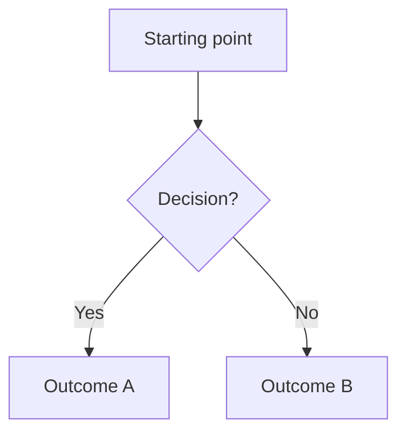

# Feature Name

## Overview

Brief description of what this feature does from the user's perspective. Focus on requirements, not implementation.

## User Flow

## Behavior

- User can ...
- When X happens, Y ...
- If no data exists, show ...

## Data Model

- `ModelName`: id, field1, field2, relation to OtherModel
- Changes to existing models: add `fieldName` to `ExistingModel`

## Edge Cases

- Empty state: ...
- Invalid input: ...
- Concurrent access: ...
- Permissions: ...

## Acceptance Criteria

- [ ] Criterion 1 (concrete, testable, unambiguous)
- [ ] Criterion 2
- [ ] Criterion 3
